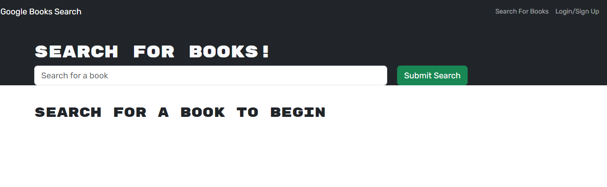
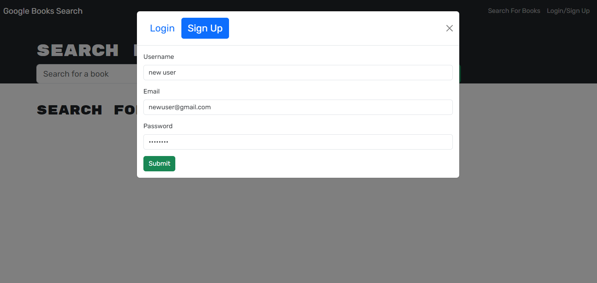
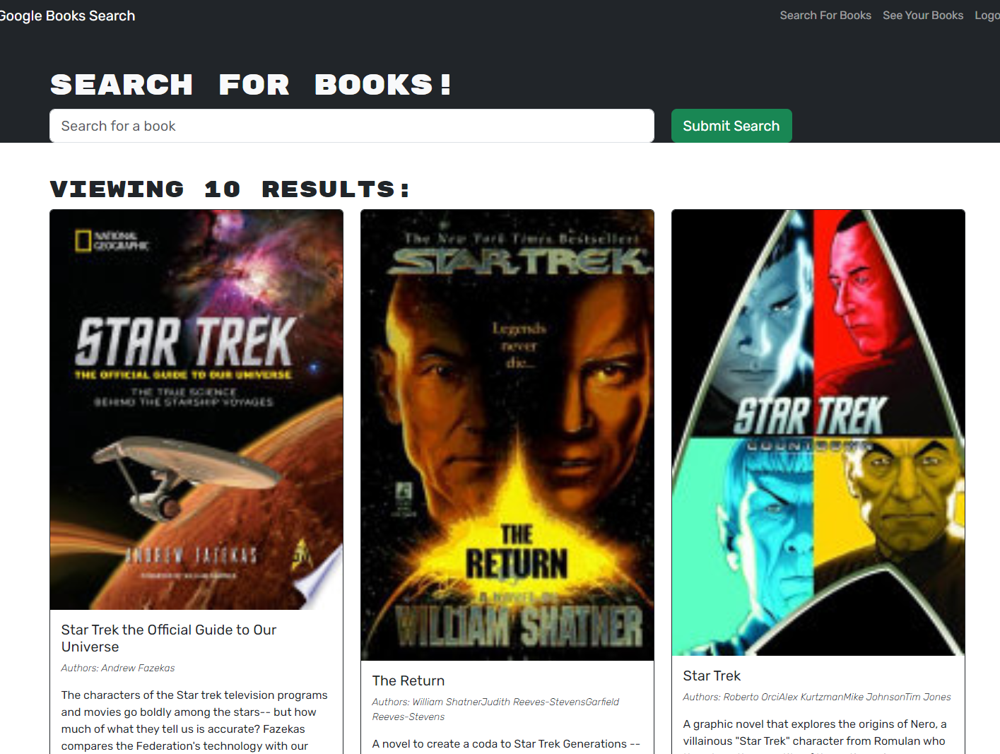

# Book Search MERN Refactor
  

  ## Description
  This is a refactor of a full stack application that shows understanding on GraphQL and the full MERN stack.
  
  ## Table of Contents
  - [Installation](#installation)
  - [Usage](#usage)
  - [License](#license)
  - [Contributing](#contributing)
  - [Questions](#questions)
  
  ## Installation
  Open this in your preferred code editor and type "npm i", then "npm run build". No further installation is needed. 
  
  ## Usage
  You need to open two terminals, the first to run the graphQL server and the other to launch the React applictation. In the first terminal , navigate to ../server and type npm start. In the second terminal, navigate to ../src and type "npm start" and that will launch the react-scripts. From here you can create and test logging in. Further still,you can go to you Apollo Server sandbox, and test the queries after adding a use and book.

  ## License
 This project is licensed under the [MIT](https://opensource.org/licenses/MIT) license.
  
  ## Contributing
  Intial Code was provided by bootcamp course.
   
  Quick start. React. (n.d.). https://react.dev/learn     
  Introduction to apollo client. Apollo Docs. (n.d.). https://www.apollographql.com/docs/react/ 
  
  
  ## Questions
  if you have any questions, you can reach me @ [ErgonomicQ](https://github.com/ErgonomicQ) or shoot me email at c.s.cooke89@gmail.com.
  